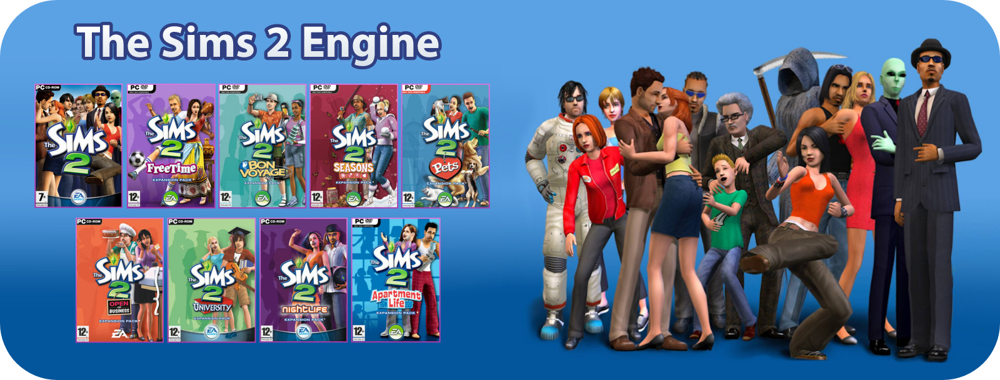
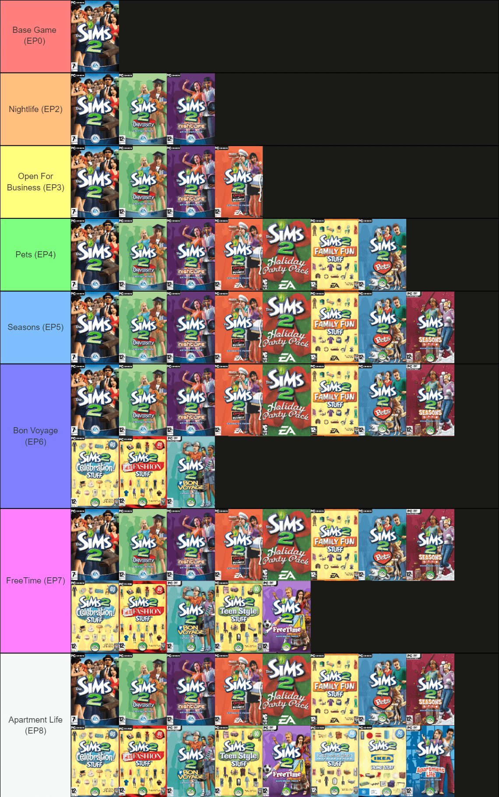

<!-- PROJECT BANNER -->
<div align="center">
  <a href="https://github.com/erfan2255/TS2E">
    
  </a>

  <h3 align="center">The Sims 2 Engine (TS2E)</h3>
  <p align="center">
    Play all engines of the sims 2 with one click
    <br/>
    <a href="https://github.com/erfan2255/TS2E/releases"><strong>Download TS2E Here</strong></a>
    <br />
    <br />
    <a href="https://youtube.com/@coreland2">Youtube</a>
    ·
    <a href="https://github.com/voicemxil/TS2-Starter-Pack">The Sims 2 Starter</a>
    ·
    <a href="https://t.me/coreland">Telegram</a>
  </p>
</div>

<!-- THE SIMS 2 ENGINE -->
## The Sims 2 Engine

Simple and easy installer to change game engine to older engines from Base Game to Apartment Life (EP8)

Latest The Sims 2 Engine is Mansion & Garden Stuff (2008) applied by default and difficult to change it manually or mostly hard for users to play older Sims 2 titles so using this installer make it possible to choose optional engine to play Sims

Supported Engines:
* Base Game
* Nightlife (EP2)
* Open For Business (EP3)
* Pets (EP4)
* Seasons (EP5)
* Bon Voyage (EP6)
* FreeTime (EP7)
* Apartment Life (EP8)
  
University Engine (EP1) not works

Check the Engine Guide list to see which expansions & stuff packs are supported

<!-- INSTALLATION -->
## Installation

1- Download The Sims 2 Origin Ultimate Collection [here](https://55woodlandrive.tumblr.com/post/643865013442969600/this-is-a-re-upload-of-g4tws-the-sims-2-origin) or Standalone Starter Pack [here](https://github.com/mintalien/The-Puppets-2-Definitive-Edition/releases)

2- Download [TS2E Installer](https://github.com/erfan2255/TS2E/releases) 

3- Extract the game and move The Sims 2 Ultimate Collection folder to drive c, like the directory below: 
   ```sh
   C:\The Sims 2 Ultimate Collection\(Double Deluxe,Seasons folders) 
   ```
4- Run TS2E, select Touchup Installer for the first time, then choose Engine. Enjoy!
* Installer only works on origin, other repacks will not work properly
* You can delete later packs that were released after selected engine to free up space
* You dont need to run touchup from `__installer` folder, I have automated it for touchup installer.
* Also includes an uninstaller to remove csbin & tsbin from any engine (tsdata will not be removed)
* To play the mansion engine again select touchup installer

If you find TS2E useful, subscribe CoreLand youtube channel. Thanks :)

[Youtube](https://youtube.com/@coreland2)

<!-- ENGINE GUIDE -->
## Engine Guide

This guide will help you find out which Expansion Packs & Stuff Packs will work on each Engine
* EP1 does not work due to lack of University No-CD patch, so Engines limited to base, EP2 to EP8
* It is highly recommended to back up your Sims save before switching engines to avoid game corruption
* If worlds fail to load properly remove the old save and try again
<div align="center">
  <a href="https://github.com/erfan2255/TS2E/blob/main/images/engineguide.png">
    
  </a>
  </div>
  


<!-- CORELAND LINKS -->
## Created by CoreLand

[Youtube Channel](https://youtube.com/@coreland2)

[Telegram Channel](https://t.me/coreland)
